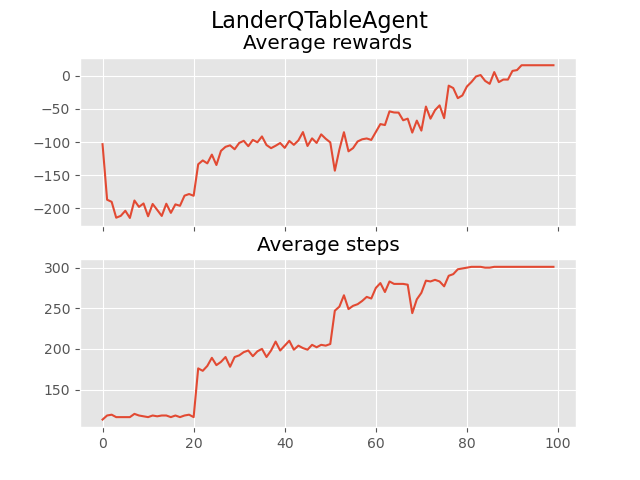
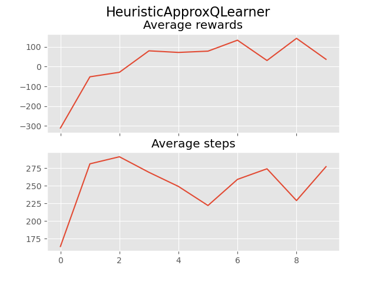
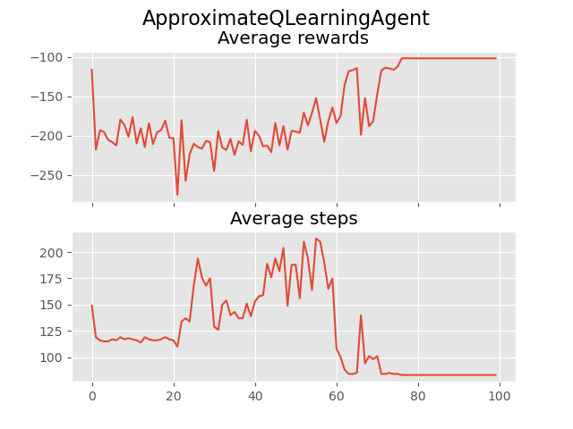

## Environment
- There are two environment versions: discrete or continuous.
- The landing pad is always at coordinates (0,0). 
- The coordinates are the first two numbers in the state vector.
- Landing outside of the landing pad is possible. Fuel is infinite, so an agent can learn to fly and then land on its first attempt.

## Action Space

There are four discrete actions available: 
    1. do nothing 0
    2. fire left orientation engine 1 
    3. fire main engine 2 
    4. fire right orientation engine. 3

For continuous, Action is two floats [main engine, left-right engines].
    1. Main engine: -1..0 off, 0..+1 throttle from 50% to 100% power. Engine can't work with less than 50% power.
    2. Left-right:  -1.0..-0.5 fire left engine, +0.5..+1.0 fire right engine, -0.5..0.5 off

## State Space
Total 8 dimensions
1. coordinates of the lander in `x` & `y`
2. its linear velocities in `x` & `y`
3. angle
4. angular velocity
5. two booleans that represent whether each leg is in contact with the ground or not

The lander starts at the top center of the viewport with a random initial force applied to its center of mass.

```
s (list): The state. Attributes:
            s[0] is the horizontal coordinate
            s[1] is the vertical coordinate
            s[2] is the horizontal speed
            s[3] is the vertical speed
            s[4] is the angle
            s[5] is the angular speed
            s[6] 1 if first leg has contact, else 0
            s[7] 1 if second leg has contact, else 0
```

## Rewards
1. Reward for moving from the top of the screen to the landing pad and coming to rest is about 100-140 points.
2. If the lander crashes, it receives an additional -100 points.
3. If it comes to rest, it receives an additional +100 points.
4. Each leg with ground contact is +10 points.
5. Firing the main engine is -0.3 points each frame. Firing the side engine is -0.03 points each frame.
6. Solved is 200 points.
## Objective

Create an agent which achieves maximum reward.

## Algorithm

## MDP

Issues:
1. Environment is too complex to understand
2. States like angular speed, velocity etc are difficult to understand and make heuristics

Understanding:
1. Heuristic is probably trying to move the lander towards the angle it makes with center.
2. There is probably no uncertainity.

Approach:
- [x] Start with a random agent to see how it behaves.
- [ ] MDP?
  - MDP will not be suitable as it will take ages to come up with the MDP model parameters i.e. the transition probs.
- [ ] Q Learning
  - https://courses.cs.washington.edu/courses/csep573/22wi/project3/index.html
  - This can be suitable for the discrete actions.
  - We can learn from experience and exploit actinos which have high chances of success while exploring slightly.
  - Problems
    -  the state space is pretty large (find the exact value) and it might again take more time to learn properly.
    -  We need to discretize the state space. This needs knowledge of max and minimum values. This will require deep understanding of state feature ranges and distributions.
  - Try changing the parameters, 
    - discount $\gamma$
    - epsilon $\epsilon$
    - learning rage $\alpha$
- [ ] Approximate Q Learning
  - [ ] This will be more suitable than Q learning as the state variables are continuous.
  - [ ] Will help with generalization
  - [ ] Prolem : need to find out features for $Q(s,a)$
    - [ ] may be i can have 4 functions for 4 separate actions. Use perceptron type logic to find the highest value out of them
    - [ ] https://www.cs.swarthmore.edu/~bryce/cs63/s16/slides/3-25_approximate_Q-learning.pdf
- [ ] Deep Q learning
  - [ ] Better than approx Q learning

# Results
## Q table

    agent = agents.LanderQTableAgent(4)

Hyper parameters

    train(env, 
        agent, 
        seed = 47, 
        render = False, 
        episodes= 10000, 
        name = name,
        verbose = False)
      agent.train(
            epsilon=getEpsilon(ep),
            gamma=0.95,
            alpha=0.3
        )

  def getEpsilon(iter):

      threshold = 50
      if iter > 200:
          threshold = 10
      if iter > 2000:
          threshold = 5
      if iter > 5000:
          threshold = 1
      if iter > 7500:
          threshold = 0
      return threshold/10


Agent was not learning as there was a problem with Q value updates

incorrect 
  
    qval += (1- self.alpha) * qval + self.alpha * sampleQ

correct
  
    qval = (1- self.alpha) * qval + self.alpha * sampleQ

## Appoximate q learning with heuristic based onehot features

```
  agent = agents.HeuristicApproxQLearner()

        features = np.zeros(4)
        if hover_todo > np.abs(angle_todo) and hover_todo > 0.05:
            features[2] = 1
        elif angle_todo < -0.05:
            features[3] = 1
        elif angle_todo > +0.05:
            features[1] = 1
```

Conclusion:
- Agent does not learn well with high learning rate.
- high exploration generally yields bad rewards.
- low exploration with low learning rate yields +ve rewards
  ```
          agent.train(
            epsilon=getEpsilon(ep),
            gamma=0.95,
            alpha=0.001
        )

        epsilon = 0.1
  ```
- It still does not learn the best heuristics. onehot features are not assigned highest labels. Example: 
  ```
  ep 1400 steps 240 reward +79.16
  [[ 0.         -0.5067327   5.96948817  0.6023203   7.53688717]
  [ 0.          0.55166405  5.37667624  0.14314042  6.50684866]
  [ 0.         -0.14081854  9.76332673  0.70381361  6.93361496]
  [ 0.         -0.02792927  6.12005603  2.08995898  6.90837691]]
  ep 1500 steps 224 reward +158.11
  [[ 0.         -0.80849731  6.20459922  0.65929478  8.89059442]
  [ 0.          1.14078767  5.80344831  0.17726023  7.97594429]
  [ 0.         -0.36009664  9.96610508  0.71622254  8.89177503]
  [ 0.         -0.02867782  6.35537343  3.24155341  8.32965188]]
  ```
-Attains maximum reward faster. But hard to design these features in general
- Proves that code and learning algorithm is correct.
- Agent can learn with better features. Learning rate needs to be slowed down once model converges. May be problem with perceptron.

## Approximate Q Learning with vannilla state features

10000 episodes. Exploration - decaying (same as q table)

  agent = agents.ApproximateQLearningAgent(8, 4)
    


Conclusion:
- Learns something but converges at reward  = -100 and avg number of steps also decreases. Looks like it's trying to reduce tiem time in air. 
- Incresing number of exploration steps does not help.
- Underfitting issue. May be linear function is not useful here
- Use deep learning or design non-linear features which are linearly separable.

## Deep Q learning
even deep model with only linear regression was not able to learn proper separation for 1dtarget in simple game.
```
0 tensor(1)
1 tensor(1)
2 tensor(1)
3 tensor(1)
4 tensor(1)
5 tensor(1)
6 tensor(1)
7 tensor(1)
8 tensor(0)
9 tensor(0)
10 tensor(0)
```
This is probably because of the sample imbalanace. The terminal states are not seen much often. Leading to model not being very precise. 
Also adding intermediate rewards if target is closer because of action - didnt help.
This is probably because the task is a regression task. Because of gamma, the prediction decreases exponentially with distance. Probably that's why linear model is not able to model that.

Let's try non linear model with more parameters.
It worked. Though there are some local minimas, the model learns accurate weight most of the times
```
0 tensor(1)
1 tensor(1)
2 tensor(1)
3 tensor(1)
4 tensor(1)
5 tensor(0)
6 tensor(0)
7 tensor(0)
8 tensor(0)
9 tensor(0)
10 tensor(0)
```
agent.evaluate()
simplegame.playOneEpisode(env, agent, 100, render = True)
[  0   0   0   0   0 100   0   0   0   1   0]
[  0   0   0   0   0 100   0   0   1   0   0]
[  0   0   0   0   0 100   0   1   0   0   0]
[  0   0   0   0   0 100   1   0   0   0   0]
[  0   0   0   0   0 100   0   0   0   0   0]